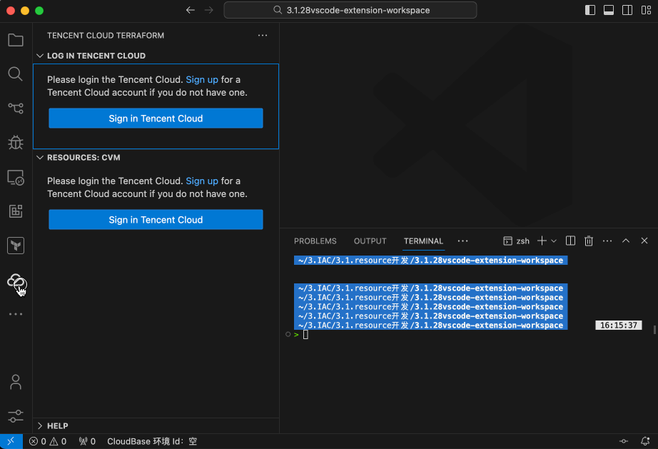
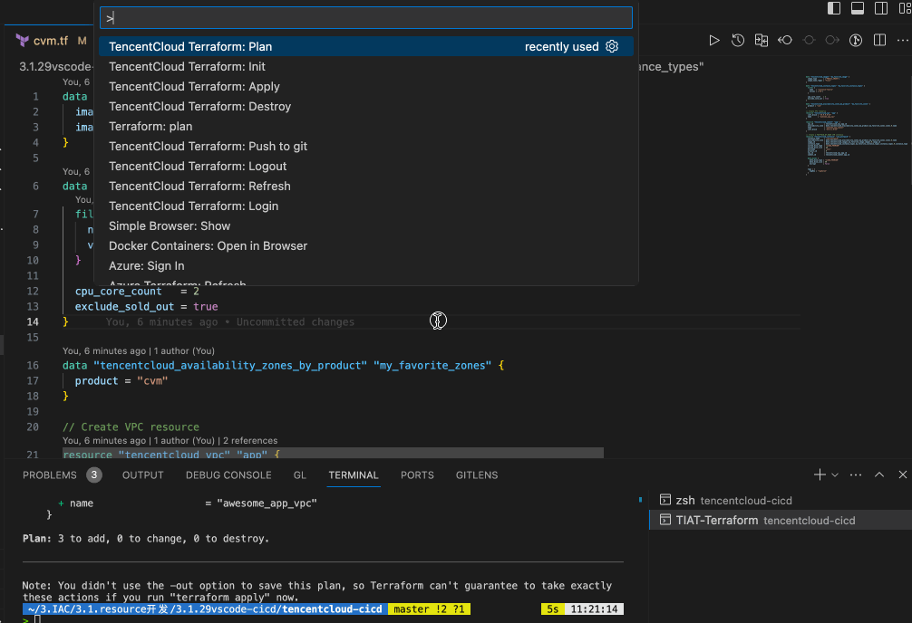
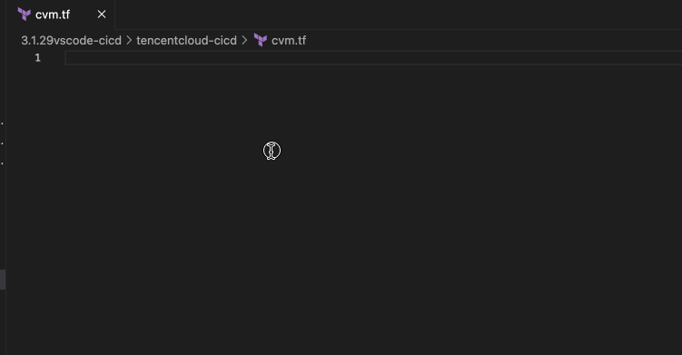
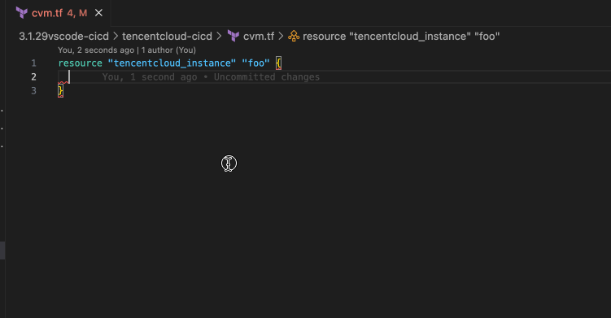
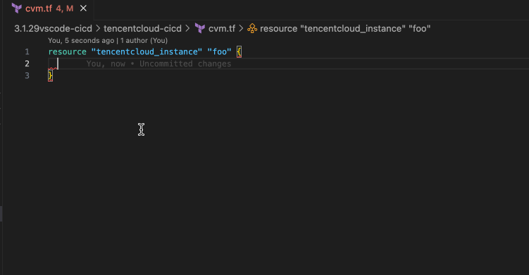
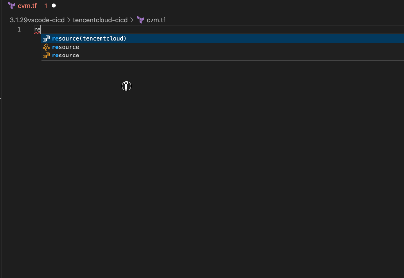
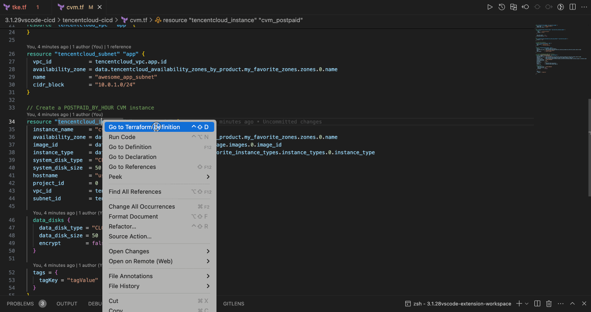

# TencentCloud Terraform

The TIAT（Tencent Infrastructure Automation for Terraform）Terraform VS Code extension is designed to improve the efficiency of DevOps when using Terraform with Tencent Cloud. The extension provides TencentCloud Account login, resource explorer, code auto-complete, argument tips, and command palette inside VSCode.

## Features

This extension supports the following features:

- Login: log in Tencent Cloud with AKSK.
- Terraform Commands: init, plan, apply, and destroy through the VSCode command Palette.
- Auto Complete: provides code suggestions and auto-complete resource types, arguments, and options. 
- Code Snippets/Example: provides a completed example code when typing the specified resource type.
- Tips: provides `Go to Terraform definition` to preview resource documents natively instead of through the official website.
- Import Resource: display the existing `CVM` resource and then import it as a tf file by [Terraformer](https://github.com/GoogleCloudPlatform/terraformer).

*TO-DO(Features to be supported in the future):*
- Visualize: graph the terraform resources and modules.
- Autocomplete: provider code snippets explorer of the specified resource.
- Validate: code check under security and compliance.

## Quick Start
### 1.Login Tencent Cloud
Provide Log in entry to Tencent Cloud.

After logged, you can see your account and detail when hovering the status bar.

### 2.Terraform Commands
Open the Command Palette (`Command`+`Shift`+`P` on macOS and `Ctrl`+`Shift`+`P` on Windows/Linux) and type in one of the following commands:

<table>
  <thead>
  <tr>
    <th>Command</th>
    <th>Description</th>
  </tr>
  </thead>
  <tbody>
  <tr>
    <td width="35%">
      Basic commands: 
      <ul>
        <li>TencentCloud Terraform: init</li>
        <li>TencentCloud Terraform: plan</li>
        <li>TencentCloud Terraform: apply</li>
        <li>TencentCloud Terraform: refresh</li>
        <li>TencentCloud Terraform: destroy</li>
      </ul>
    </td>
    <td>
      Execute terraform command against the current project workspace.
    </td>
  </tr>
  <tr>
    <td width="35%">
      Login commands: 
      <ul>
        <li>TencentCloud Terraform: Login</li>
        <li>TencentCloud Terraform: Logout</li>
      </ul>
    </td>
    <td>
      The shortcut of log in and log out with Tencent Cloud.
    </td>
  </tr>
  </tbody>
</table>

### 3.Auto Complete
When you typing the resource type, attribute, and options, there is a suggestions dialog.

#### Resource Type

#### Argument

#### Options(demo)
> NOTE: only support on `tencentcloud_instance` resource.

### 4.Code Snippets/Example
When you typing the `{` after a resource type and name, there is a example suggestions.

Press `Enter` to insert the whole example.

### 5.Import Resource(demo)
> NOTE: only support on `tencentcloud_instance` resource.
When you logged into Tencent Cloud Account, you may see the resources under this account.

Choose one resource to import it.
After a few minutes, the import resource will be in the `generated` folder.

### 6.Resource definition
When you open a menu on a terraform resource, click the `Go to Terraform Definition` (`ctrl+shift+D` on macOS/Linux/Windows) item to open a preview panel to display the resource document locally.

## Requirements

This extension requires:

- [Terraform](https://www.terraform.io/downloads.html) - If you are executing terraform commands in integrated teminal.
- [Node.js 6.0+](https://nodejs.org) - If you are using Cloud Shell.
- [GraphViz](http://www.graphviz.org) - If you are using the visualize feature.

> NOTE: Please make sure these requirements are in your PATH environment variable.

## Extension Settings

- `tcTerraform.secretid` and `tcTerraform.secretkey`: specify the your tencentcloud secret id and key.
- `tcTerraform.terminal`: Specifies terminal used to run Terraform commands. Valid settings are `cloudshell`(TO-DO) or `integrated`.
- `tcTerraform.checkTCCLI`: specifies whether or not TCCLI installed in the PATH. 

## License
[MIT](LICENSE.md)

## Reference
- [Document - TencnetCloud Terraform Registry](https://registry.terraform.io/providers/tencentcloudstack/tencentcloud/latest/docs)
- [Repo - TencnetCloud Terraform Provider ](https://github.com/tencentcloudstack/terraform-provider-tencentcloud)
- [Tencent Cloud Terraform extension - Visual Studio Marketplace](https://marketplace.visualstudio.com/items?itemName=Tencent-Cloud.vscode-tencentcloud-terraform)

**Enjoy!**
